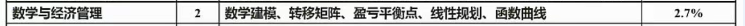

# 数学与经济管理

很多内容只出现一次，计算题最后做，实在不会就放弃

<!-- more -->

## 图论应用

- 最小生成树（★)
  - 普利姆算法
  - 克鲁斯卡尔
- 最短路径（次)
  - 迪杰斯特拉
- 网络与最大流量（★★)
  - 小流量是瓶颈

## 运筹方法

### 线性规划（★)

- 初高中数学题

### 动态规划（★★★)

- 考试穷举即可

#### 转移矩阵

一个月计算一次，两个月计算两次

#### 排队论（水池放水问题）

### 预测与决策（★)

#### 不确定性决策

**例题**

#### 决策树

#### 决策表

## 数学建模（★★)

（碰到积累即可）

数学建模是一种数学的思考方法，是运用数学的语言和方法，通过抽象和简化，建立能近似刻画并解决实际问题的模型的一种强有力的数学手段。

### 数学建模过程

- 模型准备：了解问题的实际背景，明确其实际意义，掌握对象的各种信息。用数学语言来描述问题
- 模型假设：根据实际对象的特征和建模的目的，对问题进行必要的简化，并用精确的语言提出一些
  恰当的假设。
- 模型建立：在假设的基础上，利用适当的数学工具来刻划各变量之间的数学关系，建立相应的数学
  结构。只要能够把问题描述清楚，尽量使用简单的数学工具。
- 模型求解：利用获取的数据资料，对模型的所有参数做出计算（估计)
- 模型分析：对所得的结果进行数学上的分析。（误差分析、敏感度分析）
- 模型检验：将模型分析结果与实际情形进行比较，以此来验证模型的准确性、合理性和适用性。如果模型与实际较吻合，则要对计算结果给出其实际含义，并进行解释。如果模型与实际吻合较差，则应该修改假设，再次重复建模过程。
- 模型应用：应用方式因问题的性质和建模的目的而异。

### 方法

直接分析法：认识原理，直接构造出模型。

类比法：根据类似问题模型构造新模型。

数据分析法：大量数据统计分析之后建模。

构想法：对将来可能发生的情况给出设想从而建模。
